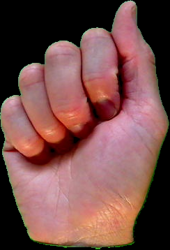
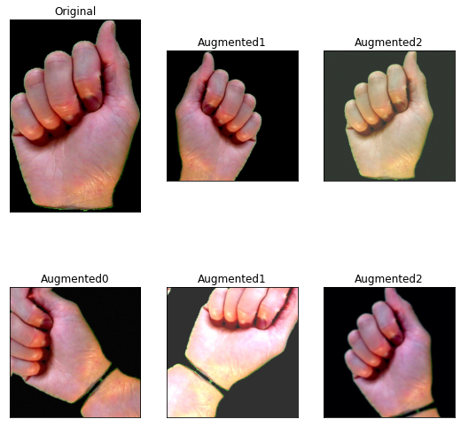
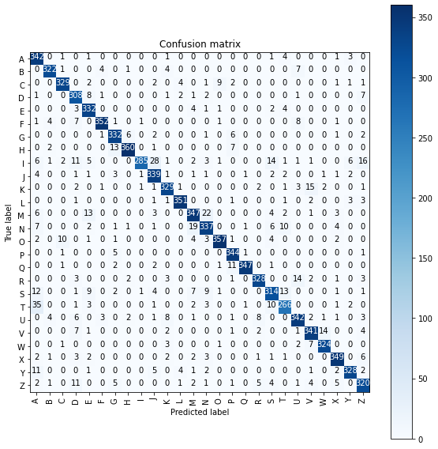

# American Sign Language Recognition

This project is done as part of mini-project in our 6th semester curriculum.

# Introduction

In this project, we aim to analyzing and recognizing alphabets from ASL. We have 
implemented this with the help of Transfer Learning with MobileNet architecture

## Dataset

The dataset is borrowed from [here](https://www.massey.ac.nz/~albarcza/gesture_dataset2012.html).

  

  <em>The Letter 'A'</em>

Since the dataset is not that huge, we have used [albumentations](https://github.com/albumentations-team/albumentations) for image augmentations
We created 25 transformations for each image present in the dataset.Some of the transformations include horizontal shift, rotation, rgb shift, hue saturation value and so on.
 

## Model Training

The model is loaded with ImageNet weights and 3 custom layers are added on top of MobileNet
The ImageNet weights are initially frozen and only the top layers are trained for first few epochs.
Then the weights are unfrozen and trained again

## Results

Confusion matrix:

